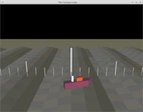
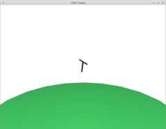
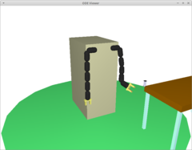
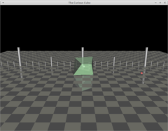
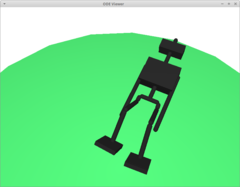

# Exercises with *pybrain*

Exercises with *pybrain*.

## Pybrain reinforcement learning learners

### methods

- value-based -- estimating a value-function
- linear function approximation -- subset of value-based methods, approximation on states 
- direct search -- *search directly in (some subset of) the policy space* (more [here](https://en.wikipedia.org/wiki/Reinforcement_learning#Direct_policy_search))
- policy gradient -- subset of direct search methods, that rely upon optimizing parametrized policies with respect to the expected return (long-term cumulative reward) by gradient descent (more [here](http://www.scholarpedia.org/article/Policy_gradient_methods))

### algorithms

- *Q* (`q.py`) -- value-based method, *algorithm to learn the value of an action in a particular state* (more [here](https://en.wikipedia.org/wiki/Q-learning))
- *QLambda* (`qlambda.py`) -- value-based method, *variation of Q-learning that uses an eligibility trace*
- *SARSA*: *State-Action-Reward-State-Action* (`sarsa.py`) -- value-based method, *algorithm for learning a Markov decision process policy* (more [here](https://en.wikipedia.org/wiki/State%E2%80%93action%E2%80%93reward%E2%80%93state%E2%80%93action))
- *NFQ*: *Neuro-fitted Q-learning* (`nfq.py`) -- value-based method, *an algorithm for efficient and effective training of a Q-value function represented by a multi-layer perceptron* (more [here](https://ml.informatik.uni-freiburg.de/former/_media/publications/rieecml05.pdf))

- *Q_LinFA* (`linearfa.py`) -- *Standard Q-learning with linear FA*
- *QLambda_LinFA* (`linearfa.py`) -- *Q-lambda with linear FA*
- *SARSALambda_LinFA* (`linearfa.py`)
- *LSTDQLambda* (`linearfa.py`) -- *least-squares Q(lambda)*
- *GQLambda* (`linearfa.py`) -- *stable methods for general off-policy learning whose computational complexity scales linearly with the number of parameters*

- *ENAC*: *Episodic Natural Actor-Critic* (`enac.py`) -- policy gradient method, estimates natural gradient with regression of log likelihoods to rewards
- *Reinforce* (`reinforce.py`) -- policy gradient method, *Simple Statistical Gradient-Following Algorithms for Connectionist Reinforcement Learning*
- *RWR*: *Reward-weighted regression* (`rwr.py`) -- direct search method, *learning at each iteration consists of sampling a batch of trajectories using the current policy and fitting a new policy to maximize a return-weighted log-likelihood of actions* (more [here](https://arxiv.org/abs/2107.09088)). Implementation limited to discrete-action episodic tasks.

## Pybrain running limitations

Pybrain seems to be not maintained anymore and for this reason is not compatible with modern python language. It has been found, that library works with following dependencies:
- *Python* language version 2.7
- *scipy* version 0.19.1
- *numpy* version 1.8.2
- *matplotlib* version 2.2.5
- *pyode* version 1.2.1 with *libode6* version 2:0.14-2 on system (might work with newer system backends)
- *pyopengl* version 3.1.5 with *libopengl0* version 1.0.0-2 on system (might work with newer system backends)
- *pillow* version 6.2.2

Moreover, because of python's `PIL` changes, *pybrain* does not work (environments viewing) straight form project's GitHub repository. For all those reasons script `lib/pybrain/install.sh` is introduced to facilitate installation of the library.

## Python's virtual environment

For all reasons pointed above user is encouraged to use virtual environment. Configuration of the environment can be as simple as execution of `tools/installvenv.sh` script. Script assumes that following components are preinstalled:
- *Python* version 2
- *virtualenv* module (tested on version 20.8.1)

Script alongside the environemnt installs proper *pybrain* and all it's dependencies stated in previous paragraph.

Starting environment after installation can be done by execution of script `venv/start.sh`. 

## Reinforcement learning environments preview

## RL environments without graphical visualization

- classic (mountaincar, acrobot, xor)
- functions
- mazes (ASCII reprezentation only)
- twoplayergames (ASCII reprezentation only)

## Environments description

### classic mountain car

Problem does not have separated environment defined. Environment is deifned inside `MountainCar` task.
Initial state is `[-0.5, 0.0]`. It consists of position and speed. Position is left bound with value `-1.4`. Right bound is given by speed equation. Speed is bound within range `[-7.0, 7.0]`.
Observation: `[postion, speed, 1]`.

Action: one of values: 0, 1, 2 meaning index of force direction applied to to car (-1.0, 0.0, 1.0)
Output: reward -- 1 if reached goal position, otherwise 0

Goal: reach goal position within 1000 iterations

### acrobot

State: ( joint angle, torque ) limited to values (-pi, pi), (-20, 20) respectively
Observation: state scaled to range [-1.0, 1.0]
Action: torque to add to arm in range [-1.0, 1.0]
Output: reward - higher the arm, greater the reward and greater the torque, lower the reward

Goal: get maximum reward within 1000 iterations

## Alternative machine learning libraries

- scikit-learn (https://scikit-learn.org) 
- Apache's MLlib (https://spark.apache.org/mllib)

## References

- pybrain (http://pybrain.org/)
- Mountain car problem (https://en.wikipedia.org/wiki/Mountain_car_problem)
