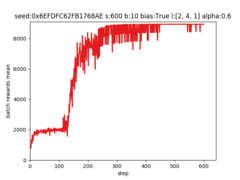
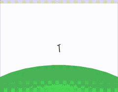

# Exercises with *pybrain*

Exercises with reinforcement learning algorithms from *pybrain*.

## Table of content

 1. [Project configuration](#project_configuration)
     1. [PyBrain dependencies](#pybrain_dependencies)
     2. [virtual environment](#virtual_env_conf)
 2. [PyBrain reinforcement learning learners](#pybrain_learners)
     1. [methods](#learning_methods)
     2. [algorithms](#learning_algorithms)
 3. [RL environments](#rl_envs_preview)
 4. [RL environments without graphical visualization](#rl_novis_envs_preview)
 5. [RL environments description](#envs_description)
     1. [classic mountain car](#classic_mountain)
     2. [acrobot](#env_acrobot)
 6. [Solutions](#solutions)
     1. [acrobot](#solution_acrobot)
 7. [PyBrain limitations](#pybrain_limitations)
 8. [Alternative machine learning libraries](#alternative_libs)
 9. [References](#references)

## Project configuration

### PyBrain dependencies

PyBrain seems to be not maintained anymore and for this reason is not compatible with modern python language. It has been found, that library works with following dependencies:
- *Python* language version 2.7
- *scipy* version 0.19.1
- *numpy* version 1.8.2
- *matplotlib* version 2.2.5
- *pyode* version 1.2.1 with *libode6* version 2:0.14-2 on system (might work with newer system backends)
- *pyopengl* version 3.1.5 with *libopengl0* version 1.0.0-2 on system (might work with newer system backends)
- *pillow* version 6.2.2

Moreover, because of python's `PIL` (*Python Imaging Library*) changes, *pybrain* does not work (environments viewing) straight form project's GitHub repository. For all those reasons script `lib/pybrain/install.sh` is introduced to facilitate installation of the library.

### virtual environment

For all reasons pointed above user is encouraged to use virtual environment. Configuration of the environment can be as simple as execution of `tools/installvenv.sh` script. Script assumes that following components are preinstalled:
- *Python* version 2
- *virtualenv* module (tested on version 20.8.1)

Script alongside the environemnt installs proper *pybrain* and all it's dependencies stated in previous paragraph.

Starting environment after installation can be done by execution of script `venv/start.sh`. 

## PyBrain reinforcement learning learners

### methods

- value-based -- estimating a value-function
- linear function approximation -- subset of value-based methods, approximation on states 
- direct search -- *search directly in (some subset of) the policy space* (more [here](https://en.wikipedia.org/wiki/Reinforcement_learning#Direct_policy_search))
- policy gradient -- subset of direct search methods, that rely upon optimizing parametrized policies with respect to the expected return (long-term cumulative reward) by gradient descent (more [here](http://www.scholarpedia.org/article/Policy_gradient_methods))

### algorithms

- *Q* (`q.py`) -- value-based method, *algorithm to learn the value of an action in a particular state* (more [here](https://en.wikipedia.org/wiki/Q-learning))
- *QLambda* (`qlambda.py`) -- value-based method, *variation of Q-learning that uses an eligibility trace*
- *SARSA*: *State-Action-Reward-State-Action* (`sarsa.py`) -- value-based method, *algorithm for learning a Markov decision process policy* (more [here](https://en.wikipedia.org/wiki/State%E2%80%93action%E2%80%93reward%E2%80%93state%E2%80%93action))
- *NFQ*: *Neuro-fitted Q-learning* (`nfq.py`) -- value-based method, *an algorithm for efficient and effective training of a Q-value function represented by a multi-layer perceptron* (more [here](https://ml.informatik.uni-freiburg.de/former/_media/publications/rieecml05.pdf))

- *Q_LinFA* (`linearfa.py`) -- *Standard Q-learning with linear FA*
- *QLambda_LinFA* (`linearfa.py`) -- *Q-lambda with linear FA*
- *SARSALambda_LinFA* (`linearfa.py`)
- *LSTDQLambda* (`linearfa.py`) -- *least-squares Q(lambda)*
- *GQLambda* (`linearfa.py`) -- *stable methods for general off-policy learning whose computational complexity scales linearly with the number of parameters*

- *ENAC*: *Episodic Natural Actor-Critic* (`enac.py`) -- policy gradient method, estimates natural gradient with regression of log likelihoods to rewards
- *Reinforce* (`reinforce.py`) -- policy gradient method, *Simple Statistical Gradient-Following Algorithms for Connectionist Reinforcement Learning*
- *RWR*: *Reward-weighted regression* (`rwr.py`) -- direct search method, *learning at each iteration consists of sampling a batch of trajectories using the current policy and fitting a new policy to maximize a return-weighted log-likelihood of actions* (more [here](https://arxiv.org/abs/2107.09088)). Implementation limited to discrete-action episodic tasks.

## RL environments

## RL environments without graphical visualization

- classic (mountaincar, acrobot, xor)
- functions
- mazes (ASCII reprezentation only)
- twoplayergames (ASCII reprezentation only)

## RL environments description

### classic mountain car

Problem does not have separated environment defined. Environment is deifned inside `MountainCar` task.
Initial state is `[-0.5, 0.0]`. It consists of position and speed. Position is left bound with value `-1.4`. Right bound is given by speed equation. Speed is bound within range `[-7.0, 7.0]`.
Observation: `[postion, speed, 1]`.

Action: one of values: 0, 1, 2 meaning index of force direction applied to to car (-1.0, 0.0, 1.0)
Output: reward -- 1 if reached goal position, otherwise 0

Goal: reach goal position within 1000 iterations

### acrobot

State: ( joint angle, torque ) limited to values (-pi, pi), (-20, 20) respectively
Observation: state scaled to range [-1.0, 1.0]
Action: torque to add to arm in range [-1.0, 1.0]
Output: reward - higher the arm, greater the reward and greater the torque, lower the reward

Goal: get maximum reward within 1000 iterations

## Solutions

### acrobot

Meta parameters:
- algorithm: *Policy Gradients with Parameter Exploration (PGPE)*
- one hidden layer with 4 neurons and bias layer
- learning rate: 0.6
- learning steps: 600
- batch episodes size: 10

Run command: `python2 ./src/brainexercises/rl/ode/acrobot_pgpe.py --hidden_layers=4 --alpha=0.6 --steps=600 --batch=10 --seed=0x6EFDFC62FB1768AE`

## PyBrain limitations

Authors of library put a lot of involvement into the library. Unfortunately there are some issues:
- `Reinforce` seems to be bogus, because it does not learn and calculates "nan" in case of zeroed parameters
- there are code comments, that some learning algoeithms are unfinished, e.g. `GPOMDP`
- library is not maintained (last commit on 2017 Dec 17)
- persisting learning process is hard (simply running *pickle* on experiment objects does not work)

## Alternative machine learning libraries

- scikit-learn (https://scikit-learn.org) 
- Apache's MLlib (https://spark.apache.org/mllib)

## References

- pybrain (http://pybrain.org/)
- Mountain car problem (https://en.wikipedia.org/wiki/Mountain_car_problem)
